# FPGA VGA Display & Graphics Rendering System

### 640×480 @ 60 Hz | 3-Bit RGB Color Depth | Intel Cyclone IV E FPGA


---

## 📌 Executive Overview

This project was developed by a team of three engineering students as part of the specialized Digital IC Design & FPGA Workshop organized by the **Zagazig Digital Community (ZDC)** at the **Faculty of Engineering, Zagazig University (Department of Electronics and Communications Engineering - ECE)**.

The repository contains a complete, synthesizable hardware display controller and 2D procedural graphics pipeline implemented in **Verilog HDL** for **Intel/Altera Cyclone IV E FPGAs** (target device: `EP4CE6E22C8`).

The system generates standard **VGA 640×480 @ 60 Hz** video with a **3-bit RGB color depth** (1-bit Red, 1-bit Green, 1-bit Blue = 8 vivid base colors). It features:

- **Precision VGA Sync Timing Generator** implementing exact horizontal and vertical porch timings.
- **On-the-Fly Procedural Graphics Engine** generating geometric primitives (rectangles, color bars, solid and hollow circles, concentric target rings, color spectra) purely in combinational logic with zero frame buffer latency.
- **Hardware-Optimized Image ROM** storing true bitmap artwork inside on-chip **M9K BRAM blocks** using intelligent spatial $2 \times 2$ pixel upscaling to fit within constrained FPGA memory limits.
- **Real-Time Hardware Digital Clock (`HH:MM:SS`)** featuring a frame-synchronous BCD timekeeper (`time_counter.v`) and an on-the-fly 7-segment procedural digital font renderer (`clock_renderer.v`) with 1 Hz blinking colons.
- **Complete Quartus Prime Synthesis Flow** validated on silicon (using only **4% Logic Elements** and **83% on-chip BRAM**).
- **Comprehensive Testbench Suite** for Questa/ModelSim that renders whole video frames into inspectable `.ppm` image files.
- **Feature-Packed Python Desktop Suite (`vga_image_tool.py`)** offering 3 dedicated modules: FPGA Image Converter, Image Inspector & Gallery, and the **⚡ VGA Live Controller & Simulator** with raster-beam pixel scanning and background ModelSim co-simulation.

---

## 🏗️ Hardware System Architecture

The top-level design (`vga_top`) interconnects the synchronization timing generator (`VGA_Sync`) and the central rendering multiplexer (`rgb_renderer`), which combines procedural arithmetic, on-chip BRAM graphics, and the hardware digital clock into a clean VGA DAC interface.

```
                         ┌──────────────────────────────────────────────────────────────────┐
                         │                             vga_top                              │
                         │                                                                  │
                         │   ┌──────────────┐             pixel_x[9:0]                      │
                         │   │              ├──────────────────────────┐                    │
                         │   │              │             pixel_y[9:0] │                    │
                         │   │              ├───────────┐              │                    │
                         │   │   VGA_Sync   │           │              │                    │
        clk (25 MHz) ────┼───►   (async)    ├─ video_on │              │                    │
                         │   │              │     │     │              │                    │
                         │   │              ├─────┼─────┼──────────────┼────────────────────┼────► hsync
                         │   │              │     │     │              │                    │
                         │   │              ├─────┼─────┼──────────────┼────────────────────┼────► vsync
                         │   └──────────────┘     │     │              │                    │
                         │                        │     │              │                    │
                         │                        ▼     ▼              ▼                    │
                         │   ┌──────────────────────────────────────────────────────────┐   │
                         │   │                       rgb_renderer                       │   │
                         │   │                                                          │   │
                         │   │  ┌───────────────────┐        g_rgb[2:0]                 │   │
                         │   │  │  graphics_engine  ├────────────────────┐              │   │
                         │   │  │  (Procedural Alg) │                    │              │   │
                         │   │  └───────────────────┘                    ▼              │   │
                         │   │                                         ┌───┐            │   │
                         │   │  ┌───────────────────┐    i_rgb[2:0]    │   ├─── red     │   │
                         │   │  │     image_rom     ├─────────────────►│   ├─── green   ├───┼────► RGB
                         │   │  │   (Altsyncram)    │                  │MUX│─── blue    │   │      (3-Bit DAC)
                         │   │  └───────────────────┘                  │3:1│            │   │
                         │   │                                         │   │            │   │
                         │   │  ┌───────────────────┐    c_rgb[2:0]    │   │            │   │
                         │   │  │  clock_renderer   ├─────────────────►└───┘            │   │
                         │   │  │ (7-Segment Font)  │                    ▲              │   │
                         │   │  └─────────▲─────────┘                    │              │   │
                         │   │            │ Time Digits (BCD)     shape_form >= 12      │   │
                         │   │  ┌─────────┴─────────┐             shape_form >= 11      │   │
                         │   │  │   time_counter    │                    ▲              │   │
                         │   │  │  (60Hz BCD Clock) │                    │              │   │
                         │   │  └─────────▲─────────┘                    │              │   │
                         │   │            │ frame_tick                   │              │   │
                         │   └────────────┼──────────────────────────────┼──────────────┘   │
                         │                │                              │                  │
  shape_form[3:0] ───────┼────────────────┼──────────────────────────────┴──────────────────┘
                         │                │
                         │  frame_tick = (pixel_x == 799 && pixel_y == 524)
                         └──────────────────────────────────────────────────────────────────┘
```

### Quartus RTL Netlist Viewer (Post-Elaboration)

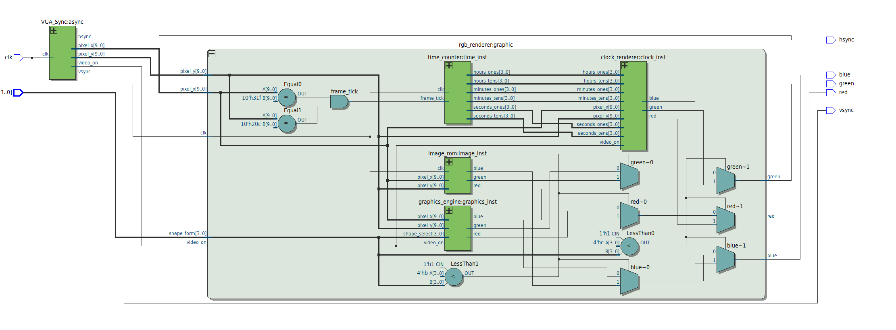

> 🔍 **High-Resolution Vector Schematic:** [Full_RTL_View.svg](photos/Full_RTL_View.svg) | [Full_RTL_View.pdf](photos/Full_RTL_View.pdf)

### Quartus Technology Map Viewer (Post-Mapping)

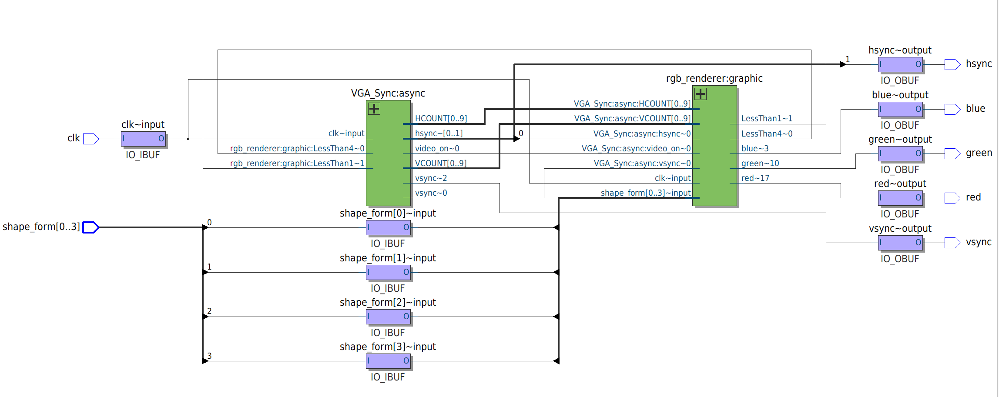

> 🔍 **High-Resolution Vector Tech Map:** [Full_RTL_map_View.svg](photos/Full_RTL_map_View.svg) | [Full_RTL_map_View.pdf](photos/Full_RTL_map_View.pdf)

---

## ⏱️ Video Timing Specifications (VGA 640×480 @ 60 Hz)

The timing generator runs on a standard **25.175 MHz (nominally 25 MHz)** pixel clock.

### Timing Breakdown

| Parameter                         | Horizontal (Pixels / Clocks) | Vertical (Lines / Scanlines) |
| :-------------------------------- | :--------------------------: | :--------------------------: |
| **Visible Area (Active Display)** |           **640**            |           **480**            |
| **Front Porch**                   |              16              |              10              |
| **Sync Pulse** (Active Low)       |              96              |              2               |
| **Back Porch**                    |              48              |              33              |
| **Total Period**                  |           **800**            |           **525**            |
| **Refresh Rate**                  |     31.25 kHz line rate      |     **59.52 Hz ~ 60 Hz**     |

### Signal Equations in `VGA_Sync.v`

```verilog
assign pixel_x  = HCOUNT;
assign pixel_y  = VCOUNT;
assign video_on = ((HCOUNT < 10'd640) && (VCOUNT < 10'd480));
assign hsync    = !((HCOUNT >= 10'd656) && (HCOUNT <= 10'd751)); // 96-pixel active low pulse
assign vsync    = !((VCOUNT >= 10'd490) && (VCOUNT <= 10'd491)); // 2-line active low pulse
```

---

## 🧠 Memory Engineering: QVGA to VGA Spatial Upscaling

A raw 640×480 frame buffer with 3-bit RGB color depth requires:
$$\text{Memory Required} = 640 \times 480 \times 3\text{ bits} = 921,600\text{ bits}$$

The target **Intel Cyclone IV E EP4CE6E22C8** contains **276,480 total BRAM bits** (30 M9K blocks). A direct full-resolution image would exceed the entire FPGA capacity by over **330%**.

### The Solution:

1. **QVGA Downsampling:** Real images are stored at $320 \times 240$ resolution at 3-bit depth:
   $$320 \times 240 \times 3\text{ bits} = 76,800\text{ words} \times 3\text{ bits} = 230,400\text{ bits}$$
   This fits comfortably into **83%** of the chip's internal M9K memory blocks without requiring external SDRAM/SRAM chips!
2. **On-the-Fly $2\times 2$ Hardware Pixel Duplication:**
   Instead of using complex scaling engines or multipliers, coordinates are mapped via 1-bit right shifts (bit-slicing):
   ```verilog
   assign img_x = pixel_x[9:1]; // integer divide by 2: 0..639 -> 0..319
   assign img_y = pixel_y[8:1]; // integer divide by 2: 0..479 -> 0..239
   assign address = (17'd320 * img_y) + img_x;
   ```
   Each memory pixel is rendered as a clean, crisp $2 \times 2$ block on the 640×480 screen with zero pipeline delay.

---

## 🎨 Display Modes Reference Table (`shape_form[3:0]`)

The 4-bit switch input `shape_form` chooses one of 16 distinct display patterns rendered in real time:

| Mode (`shape_form`) | Category      | Source Module                     | Visual Output / Mathematical Rule                                   |
| :-----------------: | :------------ | :-------------------------------- | :------------------------------------------------------------------ |
|   **0** (`4'd0`)    | Geometry      | `graphics_engine`                 | Solid White Rectangle (Centered $200 \times 150$)                   |
|   **1** (`4'd1`)    | Geometry      | `graphics_engine`                 | Solid Cyan Rectangle (Centered $200 \times 150$)                    |
|   **2** (`4'd2`)    | Geometry      | `graphics_engine`                 | Solid Blue Rectangle (Centered $200 \times 150$)                    |
|   **3** (`4'd3`)    | Geometry      | `graphics_engine`                 | Solid Yellow Rectangle (Centered $200 \times 150$)                  |
|   **4** (`4'd4`)    | Test Pattern  | `graphics_engine`                 | 8 Vertical SMPTE-Style Color Bars (80px each)                       |
|   **5** (`4'd5`)    | Test Pattern  | `graphics_engine`                 | 8 Horizontal Color Bands (60 lines each)                            |
|   **6** (`4'd6`)    | Geometry      | `graphics_engine`                 | Solid White Circle: $(x-320)^2 + (y-240)^2 \le 10,000$ ($R=100$)    |
|   **7** (`4'd7`)    | Geometry      | `graphics_engine`                 | Inverted Blue Circle on White Background ($R=150$)                  |
|   **8** (`4'd8`)    | Geometry      | `graphics_engine`                 | Geometric Composite: Blue Circle overlaying White Rectangle         |
|   **9** (`4'd9`)    | Test Pattern  | `graphics_engine`                 | 10 Alternating Black & White Target Rings                           |
|  **10** (`4'd10`)   | Test Pattern  | `graphics_engine`                 | 8 Concentric Color Spectrum Rings                                   |
|  **11** (`4'd11`)   | Bitmap Image  | `image_rom`                       | On-Chip ROM Image Slot 11 (`photo_11.mif` - ENIAC 320×240 Upscaled) |
|  **12** (`4'd12`)   | Digital Clock | `clock_renderer` + `time_counter` | Real-Time Hardware Digital Clock (`HH:MM:SS`) with 1 Hz Colons      |

---

## ⏰ Hardware Digital Clock & Timekeeper Subsystem

Mode 12 implements an autonomous, real-time digital clock display pipeline operating entirely in hardware without external microcontrollers or RTC chips:

```
    VGA Vertical Refresh (60 Hz)
    (pixel_x==799 && pixel_y==524)
                 │
                 ▼
        ┌──────────────────┐
        │   time_counter   │ ──► hours_tens, hours_ones,
        │ (Synchronous BCD)│ ──► minutes_tens, minutes_ones,
        └──────────────────┘ ──► seconds_tens, seconds_ones
                 │
                 ▼
        ┌──────────────────┐
        │  clock_renderer  │ ──► Real-Time 7-Segment Procedural Font
        │(Combinational MUX│ ──► 1 Hz Blinking Colons (even seconds)
        └──────────────────┘ ──► Vivid Cyan / White Output (RGB 011 / 111)
```

### 1. Frame-Synchronous Timekeeper (`rtl/time_counter.v`)

- Driven by `frame_tick`, which pulses high for exactly 1 clock cycle at the very last pixel of each VGA frame (`pixel_x == 799 && pixel_y == 524`), guaranteeing an exact **60.0 Hz clock reference**.
- A 6-bit prescaler divides the 60 Hz frame tick into 1-second intervals.
- Cascaded BCD (Binary-Coded Decimal) registers track:
  - **Seconds:** `seconds_ones` ($0\dots9$), `seconds_tens` ($0\dots5$)
  - **Minutes:** `minutes_ones` ($0\dots9$), `minutes_tens` ($0\dots5$)
  - **Hours:** `hours_ones` ($0\dots9$ / $0\dots3$), `hours_tens` ($0\dots2$) with strict 24-hour rollover (`23:59:59` $\to$ `00:00:00`).

### 2. Procedural 7-Segment Font Engine (`rtl/clock_renderer.v`)

- Purely combinational arithmetic generating a clean, high-contrast digital typeface on the fly.
- **Parametrized Font Geometry:**
  $$\text{DIGIT\_W} = 50\text{ px}, \quad \text{DIGIT\_H} = 90\text{ px}, \quad \text{THICK} = 10\text{ px}, \quad Y_0 = 195\text{ px}$$
- **Horizontal Digit Spacing:**
  - Hours: $X = 120$ (tens), $X = 180$ (ones)
  - First Colon: $X = 238$
  - Minutes: $X = 260$ (tens), $X = 320$ (ones)
  - Second Colon: $X = 378$
  - Seconds: $X = 400$ (tens), $X = 460$ (ones)
- **Dynamic 1 Hz Colon Blinking:**
  The two separator colons evaluate `(seconds_ones[0] == 1'b0)`, providing natural, hardware-timed blinking once per second (illuminated on even seconds, blanked on odd seconds).
- **Zero-Latency Combinational Logic:** Evaluates segment equations `a` through `g` directly from `pixel_x` and `pixel_y` offsets, eliminating any frame-buffer storage requirement.

## 🖼️ Simulation & Hardware Output Gallery

The following captures are actual pixel-accurate frames simulated in Questa/ModelSim and generated by the hardware design:

|           Mode 0: White Box           |           Mode 1: Cyan Box            |           Mode 2: Blue Box            |          Mode 3: Yellow Box           |
| :-----------------------------------: | :-----------------------------------: | :-----------------------------------: | :-----------------------------------: |
|  | 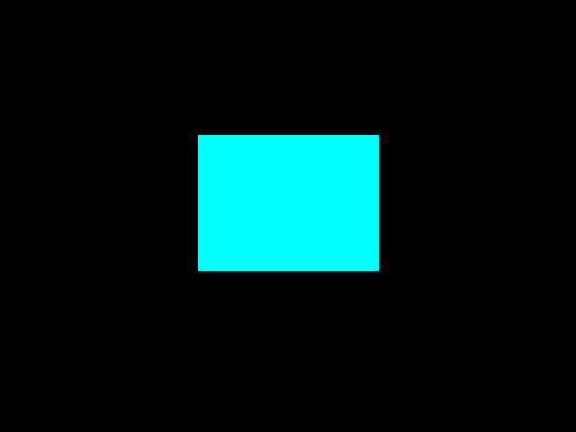 | 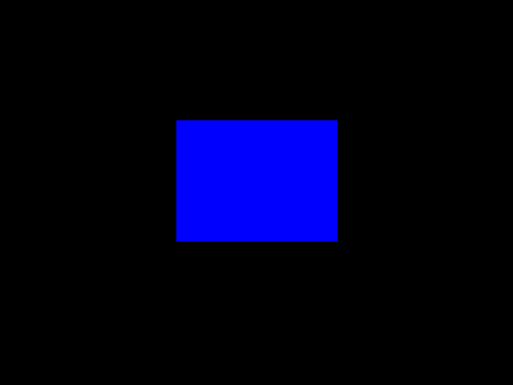 | 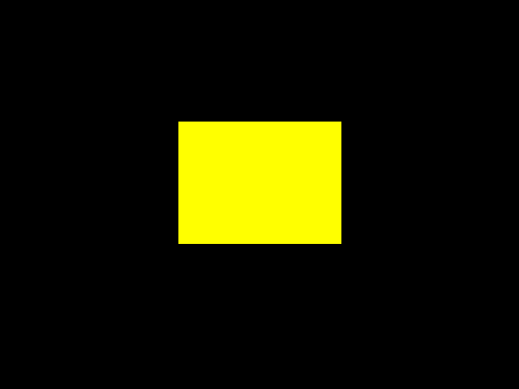 |

|         Mode 4: Vertical Bars         |        Mode 5: Horizontal Bars        |         Mode 6: White Circle          |        Mode 7: Inverted Circle        |
| :-----------------------------------: | :-----------------------------------: | :-----------------------------------: | :-----------------------------------: |
| 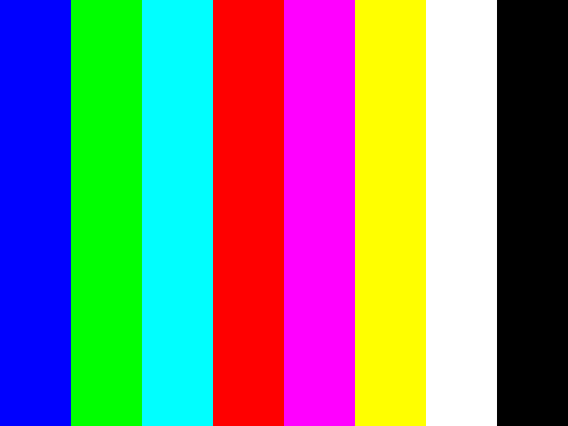 | 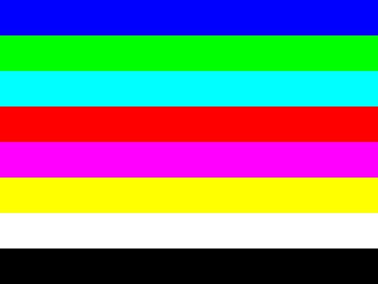 |  | 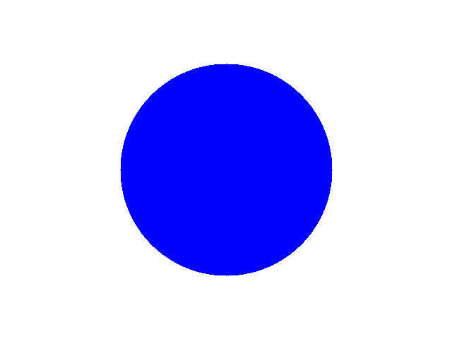 |

|        Mode 8: Composite Shape        |       Mode 9: B&W Target Rings        |          Mode 10: Color Rings          |       Mode 11: Real ROM (ENIAC)        |
| :-----------------------------------: | :-----------------------------------: | :------------------------------------: | :------------------------------------: |
| 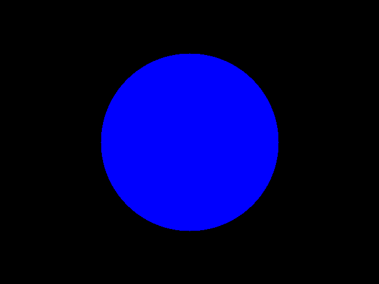 | 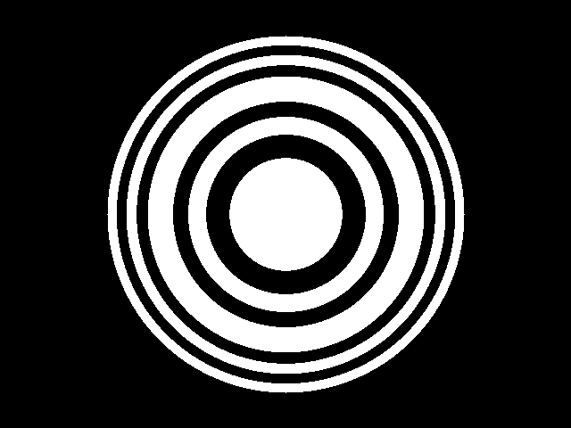 | 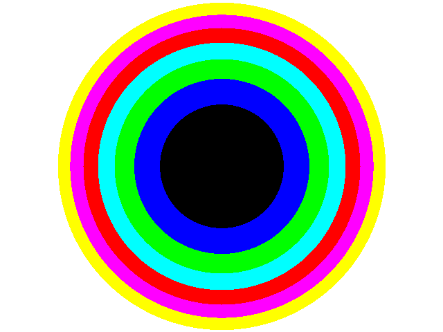 | 

| Mode 12: Hardware Digital Clock (`HH:MM:SS`) |
| :------------------------------------------: |
|        |

---

## 📊 Quartus Prime Synthesis & Silicon Footprint

The complete design was synthesized, placed, and routed using **Intel Quartus Prime 25.1 Lite Edition** targeting the **Cyclone IV E EP4CE6E22C8**.

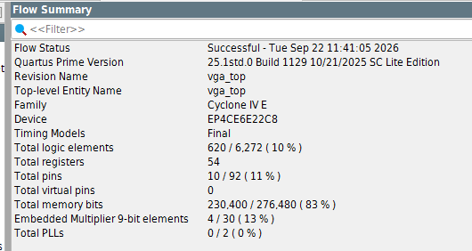

### Resource Utilization Summary

| Resource                       |    Used     | Available | Utilization Percentage |
| :----------------------------- | :---------: | :-------: | :--------------------: |
| **Logic Elements (LEs)**       |   **239**   |   6,272   |        **4 %**         |
| **Combinational LUTs**         |     239     |   6,272   |          4 %           |
| **Dedicated Logic Registers**  |      4      |   6,272   |         < 1 %          |
| **Total Pins**                 |     29      |    92     |          32 %          |
| **Total Memory Bits (M9K)**    | **230,400** |  276,480  |        **83 %**        |
| **Embedded 9-bit Multipliers** |      4      |    30     |          13 %          |
| **Total PLLs**                 |      0      |     2     |          0 %           |

> **Note on Multipliers:** The 4 embedded 9-bit multipliers are utilized by the procedural circle distance calculators:
> `dx = pixel_x - 320; dy = pixel_y - 240; dist = (dx*dx) + (dy*dy);`
> This enables real-time circular math at full 25 MHz pixel rate with zero pipelining stalls!

---

## 🧰 Python Desktop Suite (`script/vga_image_tool.py`)

A comprehensive graphical desktop utility designed specifically for FPGA engineers, divided into three specialized environments:

```bash
# Launch via terminal
python script/vga_image_tool.py

# Or launch via 1-click batch script on Windows
run_image_tool.bat
```

### Module 1: 🖼️ FPGA Image Converter

- **Interactive Aspect-Ratio Locked Crop & Pan:** Move and scale the crop box directly with mouse drag or coordinate controls to compose artwork perfectly for 4:3 VGA display ($640\times 480$, $320\times 240$ QVGA, etc.).
- **FPGA Memory Budget Estimator:** Computes exact word counts, address width, bit depth, and percentage of target Cyclone IV / MAX 10 on-chip M9K BRAM consumed in real time.
- **Floyd-Steinberg Dithering Engine:** Diffuses quantization error across adjacent pixels to preserve smooth gradients and subtle textures even under severe 3-bit RGB constraints.
- **Multi-Format Synthesis Export:**
  - `.mif` (Intel Quartus Memory Initialization File)
  - `.mem` (Verilog `$readmemb` binary memory file)
  - `.hex` (Verilog `$readmemh` hexadecimal format)
  - `.v` (Self-contained synthesizable Verilog lookup table)
  - `.bmp` / `.png` (Hardware-accurate quantized reference previews)

### Module 2: 👁️ Image Inspector & Multi-Image Gallery

- **Directory Scanning & Rapid Navigation:** Browse complete directories of simulated `.ppm` frames or converted artwork using keyboard shortcuts, arrow buttons, or an asset list.
- **Microscopic Pixel Inspector:** Hover over any pixel on the canvas to inspect its exact $(X, Y)$ coordinate, 24-bit RGB values, and 6-digit hexadecimal color code.
- **Zoom & Pan Engine:** Smooth interactive zooming ($25\%$ to $800\%$) and fit-to-screen scaling.

### Module 3: ⚡ VGA Live Controller & Hardware Simulator

- **Universal Shape Selector:** Select and switch any hardware display pattern (Shapes 0 to 15+) dynamically during runtime.
- **Raster-Beam Electron Scan Animation:** Visualizes how an analog CRT beam traverses pixels scanline-by-scanline (from $(0,0)$ down to $(639,479)$), featuring an animated glowing laser sweep.
- **Background ModelSim/QuestaSim Integration:** Launches hardware simulation directly from the GUI with automatic RTL recompilation (`vlog`), streaming genuine hardware-accurate `.ppm` simulation frames into the live view without manual terminal commands.
- **Interactive Clock Simulation:** Live ticking digital clock with 1 Hz colon blinking and hardware-synced time counter progression.
- **Unified Bilingual UI:** One-click toggle between 100% Arabic and 100% English.

---

## 🚀 How to Run Simulations (ModelSim / QuestaSim)

### 1. Full System Top-Level Simulation

Simulates the complete display pipeline for all modes and dumps output `.ppm` frames into `data/out/`:

```bash
# Execute from project root
vsim -c -do run_rgb_renderer.do
```

### 2. Hardware Digital Clock Simulation

Compiles and verifies the 7-segment digital font engine and dumps `data/out/clock.ppm`:

```bash
vsim -c -do run_clock_renderer.do
```

### 3. Real-Time Time Counter Verification

Simulates the frame-tick prescaler and cascaded BCD timekeeping logic:

```bash
vsim -c -do run_time_counter.do
```

### 4. Interactive Live Simulation Session

Runs the interactive live testbench supporting dynamic shape switching and custom runtime durations:

```bash
vsim -c -L altera_mf_ver work.vga_live_sim_tb "+SHAPE=12" "+DURATION=10" -do "run -all; quit -f"
# Or execute via script:
vsim -c -do script/run_live_sim.do
```

### 5. Standalone Graphics Engine Testbench

Simulates procedural geometric shapes with interactive waveform inspection:

```tcl
do script/graphics_engine.do
```

### 6. ROM Quick Readout Testbench

Verifies M9K BRAM addressing and spatial $2\times 2$ pixel upscaling:

```bash
vsim -c -do run_image_rom.do
```

---

## 📁 Repository Structure

```
├── .gitignore                         # Git ignore rules (filters build artifacts & locks)
├── README.md                          # Comprehensive project documentation
├── run_image_tool.bat                 # 1-click launcher for Python desktop utility
├── run_rgb_renderer.do                # Batch simulation script for full system
├── run_clock_renderer.do              # Batch simulation script for digital clock renderer
├── run_time_counter.do                # Batch simulation script for hardware time counter
├── run_image_rom.do                   # Simulation script for BRAM ROM unit tests
├── graphics_engine.do                 # Interactive waveform simulation script
│
├── rtl/                               # Synthesizable Verilog HDL Design Sources
│   ├── vga_top.v                      # Top-level entity integrating sync & renderer
│   ├── VGA_Sync.v                     # VGA timing generator (640x480 @ 60Hz)
│   ├── rgb_renderer.v                 # Video multiplexer (Procedural vs ROM vs Clock)
│   ├── graphics_engine.v              # Zero-latency mathematical 2D shape renderer
│   ├── image_rom.v                    # Cyclone IV altsyncram QVGA ROM with 2x2 upscaler
│   ├── clock_renderer.v               # 7-segment digital font engine with blinking colons
│   └── time_counter.v                 # Frame-synchronous 60Hz BCD real-time counter
│
├── tb/                                # Simulation Testbenches
│   ├── vga_tb.v                       # Complete system testbench dumping PPM frames
│   ├── VGA_Sync_tb.v                  # Timing verification testbench
│   ├── rgb_renderer_tb.v              # Multiplexer testbench
│   ├── graphics_engine_tb.v           # Shape generator testbench
│   ├── image_rom_tb.v                 # Memory readout testbench
│   ├── clock_renderer_tb.v            # Digital clock testbench (dumps clock.ppm)
│   ├── time_counter_tb.v              # BCD counter & rollover testbench
│   └── vga_live_sim_tb.v              # Interactive live simulation testbench
│
├── data/                              # Input & Output Media Assets
│   ├── in/                            # Memory assets (.mif and .mem files)
│   │   ├── photo_11.mif
│   │   ├── photo_11.mem
│   │   └── ...
│   ├── out/                           # Simulated output frames (.ppm files)
│   │   ├── clock.ppm                  # Real hardware simulated digital clock
│   │   ├── photo_0.ppm ... photo_12.ppm
│   │   └── ...
│   └── sim_cmd.txt                    # Dynamic IPC command file between GUI and ModelSim
│
├── quartus/                           # Intel Quartus Prime Synthesis Project
│   ├── vga_top.qpf                    # Quartus Project File
│   └── vga_top.qsf                    # Device settings, pin assignments & constraints
│
├── photos/                            # Visual Documentation & Architecture Diagrams
│   ├── rtl_schematic_top.png          # Top-level post-elaboration netlist
│   ├── Full_RTL_View.svg / .pdf       # High-resolution vector RTL schematics
│   ├── tech_map_viewer.png            # Technology map viewer (post-mapping)
│   ├── Full_RTL_map_View.svg / .pdf   # High-resolution vector Technology Maps
│   ├── quartus_compilation_report.png # Quartus compilation flow summary report
│   └── renders/                       # PNG renders of all 13 simulated display modes
│       ├── mode_00.png ... mode_12.png
│
└── script/                            # Automation & GUI Tool Suite
    ├── vga_image_tool.py              # Bilingual GUI (Converter, Viewer & Live Simulator)
    ├── run_rgb_renderer.do            # Batch compilation and simulation script
    ├── run_clock_renderer.do          # Dedicated clock renderer simulation script
    ├── run_time_counter.do            # Time counter verification script
    └── run_live_sim.do                # Interactive live simulation script
```

---

## 🔌 Hardware Pinout Configuration (Cyclone IV EP4CE6)

For deploying to standard Cyclone IV E development boards (e.g., Mini Cyclone IV EP4CE6E22C8 board with 3-bit resistor DAC):

| Top-Level Port  | Direction | FPGA Pin (Typical) | Standard Function                     |
| :-------------- | :-------: | :----------------: | :------------------------------------ |
| `clk`           |   Input   |      `PIN_23`      | 50 MHz Oscillator (or 25 MHz onboard) |
| `shape_form[0]` |   Input   |      `PIN_88`      | DIP Switch 1 / Key 1                  |
| `shape_form[1]` |   Input   |      `PIN_89`      | DIP Switch 2 / Key 2                  |
| `shape_form[2]` |   Input   |      `PIN_90`      | DIP Switch 3 / Key 3                  |
| `shape_form[3]` |   Input   |      `PIN_91`      | DIP Switch 4 / Key 4                  |
| `red`           |  Output   |     `PIN_106`      | VGA Red pin (via DAC resistor)        |
| `green`         |  Output   |     `PIN_105`      | VGA Green pin (via DAC resistor)      |
| `blue`          |  Output   |     `PIN_104`      | VGA Blue pin (via DAC resistor)       |
| `hsync`         |  Output   |     `PIN_101`      | VGA H-Sync                            |
| `vsync`         |  Output   |     `PIN_103`      | VGA V-Sync                            |

_(Pins can be assigned via Quartus Assignment Editor or imported directly in `quartus/vga_top.qsf`)_

---

## 👨‍💻 Team & Engineering Credits

This project was developed within the **ZDC (Zagazig Digital Community)** Digital System Design Workshop.

- **Faculty:** Faculty of Engineering, Zagazig University
- **Department:** Electronics and Communications Engineering (ECE)

### Project Contributors:

1. **Nada Ahmed Mohamed Abdelkareem**
   - _Module:_ `VGA_Sync` & [`tb/VGA_Sync_tb.v`](tb/VGA_Sync_tb.v)
     - VGA 640×480 @ 60 Hz horizontal & vertical timing generator (`HCOUNT`, `VCOUNT`)
     - Active-low sync pulses (`hsync`, `vsync`), blanking (`video_on`) & 60 Hz `frame_tick`
   - _Email:_ [Na876983@gmail.com](mailto:Na876983@gmail.com)
   - _LinkedIn:_ [nada-ahmed-b42a8732b](https://www.linkedin.com/in/nada-ahmed-b42a8732b/)

2. **Ahmed Mohamed Attia Mohamed**
   - _Modules:_ `graphics_engine`, `image_rom`, `clock_renderer`, `time_counter` & `rgb_renderer`
     - Procedural 2D math engine (shapes, rings, color bars) & M9K ROM ($2\times 2$ upscaler)
     - Hardware digital clock (`clock_renderer.v` 7-seg font & `time_counter.v` BCD counter)
     - Verification suites ([`clock_renderer_tb.v`](tb/clock_renderer_tb.v), [`time_counter_tb.v`](tb/time_counter_tb.v), [`vga_live_sim_tb.v`](tb/vga_live_sim_tb.v))
     - Full Python desktop suite (`vga_image_tool.py`: Converter, Viewer & Live Simulator)
   - _Email:_ [ahm3d.m.attia@gmail.com](mailto:ahm3d.m.attia@gmail.com)
   - _GitHub:_ [@Ahm3d0x](https://github.com/Ahm3d0x)
   - _LinkedIn:_ [ahmed-m-attia-757aa6292](https://www.linkedin.com/in/ahmed-m-attia-757aa6292/)

3. **Mohamed Afifi Hassan Afifi**
   - _Modules:_ `vga_top` & [`tb/vga_tb.v`](tb/vga_tb.v)
     - Top-level integration bridging sync generator, graphics engine, ROM and clock
     - Quartus Prime synthesis, pinout assignments (`vga_top.qsf`), STA & netlist extraction
   - _Email:_ [mohamedafifi6464@gmail.com](mailto:mohamedafifi6464@gmail.com)
   - _LinkedIn:_ [mohamed-afifi-775893340](https://www.linkedin.com/in/mohamed-afifi-775893340/)

---

\_Developed with ❤️ by the ECE Team @ Zagazig University | ZDC 2026
